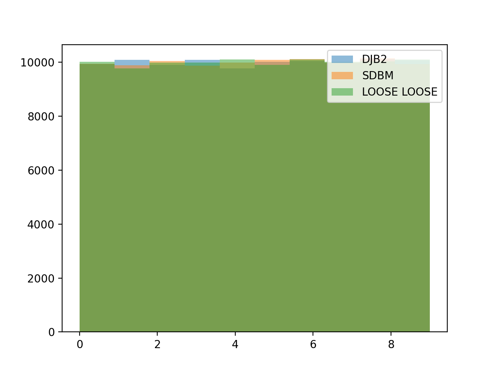

# Куда войти? Равномерное распределение строк
[Telegram: Contact @kydavoiti](https://t.me/kydavoiti/53)

Недавно  пришлось задуматься о функции, которая позволит равномерно распределить строки по частям. Надо было, чтобы были верны свойства: 
- Хеш одного элемента всегда идентичен
- Случайная величина хеша по модулю  `N` распределена равномерно на промежутке от `0` до `N`

Хотелось явно сделать функцию для равномерно распределения элементов со строковыми `ID` по ячейкам.

Я нашел вот такую [страничку](http://www.cse.yorku.ca/~oz/hash.html) с набором функций хеширования для строк. Имеется 3 алгоритма: **djb2**, **sdbm**, **lose lose**.  Подробнее про них можно почитать по ссылке. Ниже я приведу результаты моего сравнения этих алгоритмов.  Вот [gist](https://gist.github.com/IlyasYOY/30c862e2184df274f10c6029d10020b7) с реализацией функций, отображение графиков и сравнение. Я указал ссылочки на реализации, которые я подсмотрел. Уж очень просто найти реализации в интернете.

Я измерил среднюю абсолютную ошибку от равномерного распределения: 
```
DJB2 error: 2.503
SDBM error: 2.49388
LOOSE LOOSE error: 2.49822
```

Это показывает, что оно почти идентичны. У меня среднее отклонение элемента от среднего равно `2.5`, что схоже с такой же ошибкой для равномерного распределения `(0, 10)`. Графики также подтвердили то, что распределение равномерное у всех функций. Что следовало и ожидать, но не думал, что это будет работать даже для коротких строк (особенно **loose loose**)



Надеюсь кому-то будет полезно. Может кому-то будет не лень проверить гипотезу принадлежности распределения модуля хеша к равномерному  формально. Мне этого показалось достаточно.

Спасибо за внимание.
